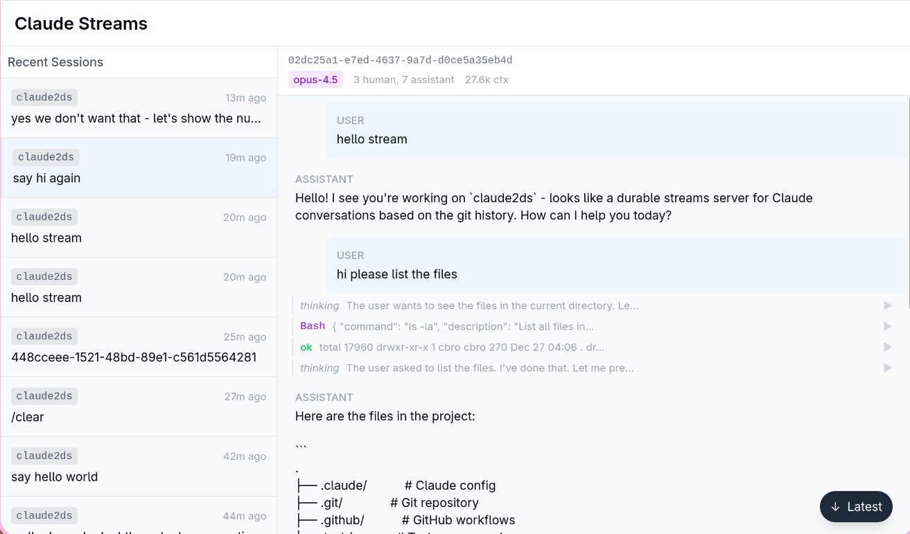

# claude2stream

Your Claude history exposed as a [Durable Stream](https://github.com/durable-streams/durable-streams/).

A streaming web UI is served  on /ui that allows you to view sessions as they happen.



## Installation

Download the latest binary for your platform from [GitHub Releases](https://github.com/broady/claude2stream/releases).

### From Source

Requires Go 1.21+ and pnpm.

```bash
cd webui/ && pnpm install && pnpm build && cd - && go build

# Or with Taskfile installed:
task build
```

## Quick Start

```bash
./claude2stream
```

Open http://localhost:8214/ui/ to view conversations.

## Usage

```
claude2stream [flags]

Flags:
  -addr string   listen address (default ":8214")
  -dir string    claude directory (default "~/.claude")
  -dev           enable CORS for development
```

## Development

```bash
# Terminal 1: Run Go backend with CORS
go run . -dev

# Terminal 2: Run Vite dev server
task dev
```

The Vite dev server runs on port 3000 and proxies API requests to the Go backend on port 8214.

## Building

```bash
task build          # Build frontend + binary
task clean          # Remove build artifacts
task release:snapshot  # Test goreleaser locally
```

## Architecture

- **Go backend**: Watches `~/.claude` for JSONL conversation files, exposes them as [durable streams](https://github.com/ahimsalabs/durable-streams-go)
- **SolidJS frontend**: Real-time conversation viewer with TanStack Router, served from `/ui/`
